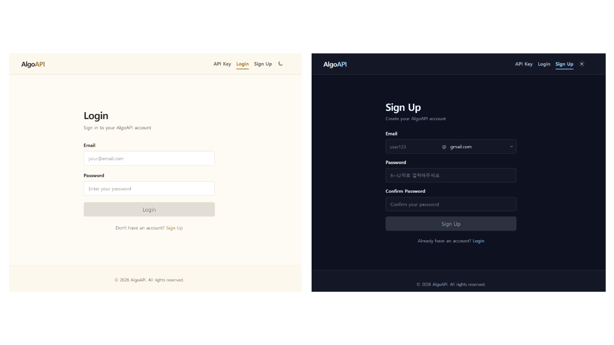
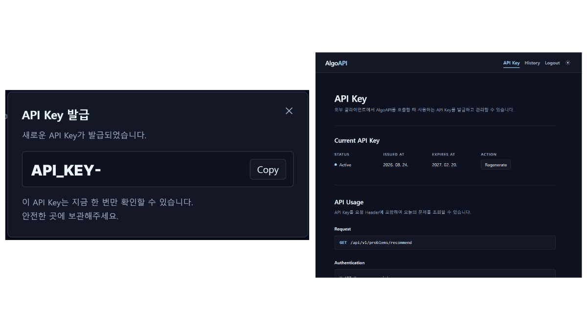
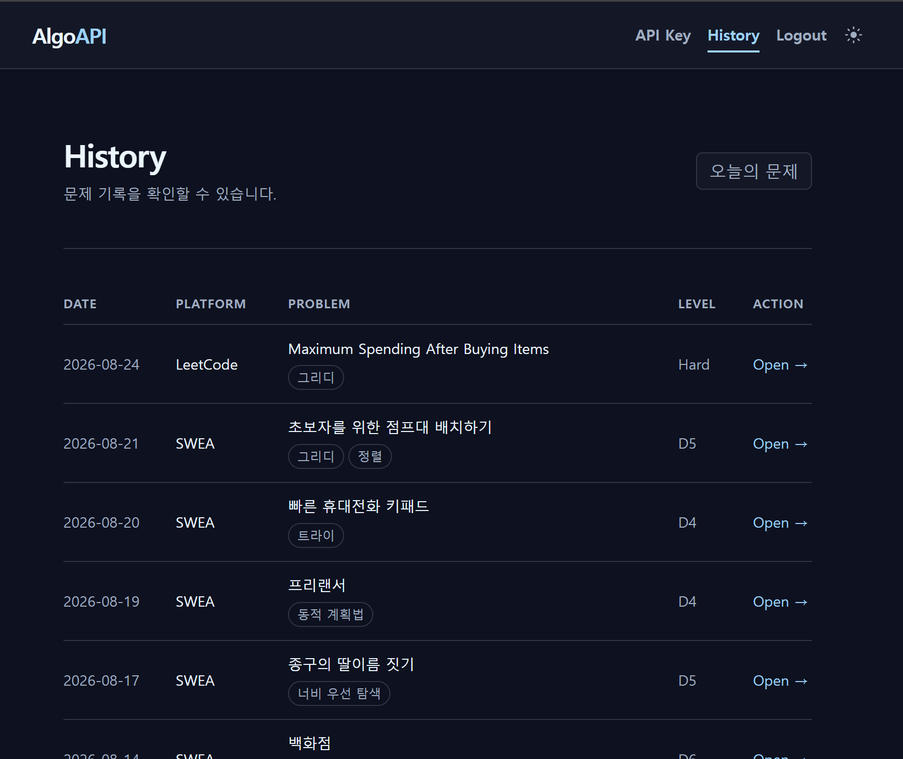

업데이트해주신 상세 내용(`Firebase Hosting`, `Asia/Seoul 기준`, `ORDER BY RAND() LIMIT 1`, `재발급 시 기존 키 즉시 비활성화` 등)을 모두 반영하여 완성한 최종 README.md입니다.

---

# AlgoAPI

> **알고리즘 문제를 고르는 시간을 줄인다**
>
> 직접 선별한 문제의 메타데이터를 자체 DB에 구축하여 제공하는 API 서비스

## 📖 프로젝트 개요

기존에는 **BOJ Random Picker**에서 solved.ac API를 활용해 알고리즘 문제를 추천했습니다.

하지만 백준 서비스 종료 이후 기존 데이터 공급 방식을 사용할 수 없게 되었고, 다른 알고리즘 플랫폼 역시 활용 가능한 공식 API가 부족했습니다.

크롤링은 사이트에서 명시적으로 금지하는 경우가 많고, 수집한 문제를 직접 검증하기 어렵다는 한계가 있었습니다.

이에 **알고리즘 문제를 고르는 시간을 줄인다**는 기존 목표를 유지하기 위해, 직접 문제를 선별하고 문제 원문이 아닌 **메타데이터만 자체 DB에 저장해 API로 제공하는 방식**을 선택했습니다.

---

## 🗓️ 개발 기간

| 구분 | 기간 |
| --- | --- |
| **문제 데이터 수집** | `2026.04` ~ 현재 |
| **1차 MVP 개발** | `2026.08.10` ~ `2026.08.15` |
| **1차 배포** | `2026.08` |

---

## ⚡ 주요 기능

* 👤 사용자 회원가입 / 로그인
* 🔑 API Key 발급 및 관리
* 🧩 웹 / API 요청을 통한 오늘의 문제 조회
* 🔒 사용자별 일일 문제 고정
* 📜 과거 추천 문제 이력 조회
* 🔗 원문 문제 페이지 연결

---

## 🛠️ 기술 스택

| 분류 | 상세 스택 |
| --- | --- |
| **Backend** | `Java` `Spring Boot` `Spring Security` `Spring Data JPA` `Gradle` |
| **Frontend** | `React 19` `TypeScript 6` `Vite 8` `Tailwind CSS 4` `React Router DOM 7` `Axios` |
| **Database** | `MySQL` |
| **Infrastructure** | `Docker` `Firebase Hosting` |
| **Authentication** | `JWT` `API Key` |

> 💡 **Frontend:** Frontend는 Codex 기반 바이브 코딩으로 구현했습니다.

---

## 🔒 인증 구조

AlgoAPI는 사용 목적에 따라 두 가지 사용자 식별 방식을 사용합니다.

```text
                        Client
                          │
               ┌──────────┴──────────┐
               │                     │
          Web Request           API Request
               │                     │
               ▼                     ▼
       JWT Authentication    API Key Authentication
               │                     │
               └──────────┬──────────┘
                          ▼
                     Spring Boot
                          │
                  Recommendation Logic
                          │
                        MySQL

```

* **JWT**: 웹 콘솔 사용자를 식별
* **API Key**: 외부 API 요청 사용자를 식별
* 인증 방식은 다르지만 동일한 문제 데이터와 추천 로직을 사용

---

## 🚀 1차 배포

> 1차 배포에서는 웹과 외부 API에서 동일한 문제 추천 데이터를 사용할 수 있도록 사용자 인증, 문제 공급, 추천 이력 관리 기능을 구현했습니다.

### 1. 회원가입 / 로그인

웹 콘솔 사용을 위한 사용자 인증 기능입니다.

* 회원가입
* 로그인
* JWT 기반 사용자 인증



---

### 2. API Key 관리

외부에서 AlgoAPI를 사용할 수 있도록 사용자별 API Key를 발급합니다.

* API Key 최초 발급
* API Key 재발급
* 재발급 시 기존 활성 Key 즉시 비활성화
* API 사용 예시 및 JSON Response 확인



---

### 3. 오늘의 문제

웹 또는 외부 API를 통해 오늘의 문제를 확인할 수 있습니다.

* JWT 또는 API Key를 통해 사용자 식별
* `Asia/Seoul` 기준 자정 이후 최초 요청 시 오늘의 문제 배정
* 동일 사용자의 같은 날짜 반복 요청 시 동일 문제 반환
* 과거에 추천받은 문제를 제외하고 새로운 문제 선택
* MySQL `ORDER BY RAND() LIMIT 1`을 이용해 문제 1개 무작위 추출

> 현재 1차 MVP에서는 복잡한 추천 알고리즘 대신, 직접 선별하고 검증한 문제 중 아직 추천받지 않은 문제를 무작위로 선택합니다.

```text
기존 추천 이력 확인
        ↓
추천 이력이 없는 문제만 조회
        ↓
  ORDER BY RAND()
        ↓
오늘의 문제 1개 선택

```

---

### 4. 추천 이력

과거에 배정받았던 문제를 확인할 수 있습니다.

* 추천 이력 최신순 조회
* 원문 문제 페이지 이동



---

## 🔮 향후 개선

### ⚙️ 문제 데이터 자동화

현재 직접 관리하고 있는 알고리즘 문제 기록을 기반으로 문제 데이터를 자동 등록할 수 있도록 개선할 예정입니다.

* `Algorithm Repository` 문제 정보 파싱
* `GitHub Actions` 기반 데이터 등록 자동화

### 🎯 문제 선택 기능 확장

현재의 오늘의 문제 제공 기능을 확장하여 사용자가 원하는 조건을 직접 선택할 수 있도록 개선할 예정입니다.

* 플랫폼 선택
* 난이도 선택
* 알고리즘 유형 선택

> 단순 랜덤 문제 제공을 넘어, 원하는 조건에 맞는 문제를 빠르게 선택할 수 있도록 확장하는 것이 목표입니다.

---

## 🔗 관련 자료

### 📌 BOJ Random Picker

AlgoAPI 이전에 개발했던 백준 문제 추천 프로그램입니다.

solved.ac API를 기반으로 문제를 추천했으며, AlgoAPI는 해당 프로젝트의 **문제 선택 시간 단축이라는 목표를 이어가기 위해 시작한 프로젝트**입니다.

* **배포 링크:** [BOJ Random Picker 링크](https://chromewebstore.google.com/detail/ijfpnmabjoobcklmokacphodhmechhdk?utm_source=item-share-cb)

### 📌 Algorithm Repository

직접 풀이한 알고리즘 문제와 코드를 지속적으로 정리하고 있는 저장소입니다.

AlgoAPI에 등록되는 문제 역시 직접 풀이하고 검증한 문제를 기준으로 관리합니다.

* **Repository:** [Algorithm Repository 링크](https://github.com/DWinging/Algorithm)
